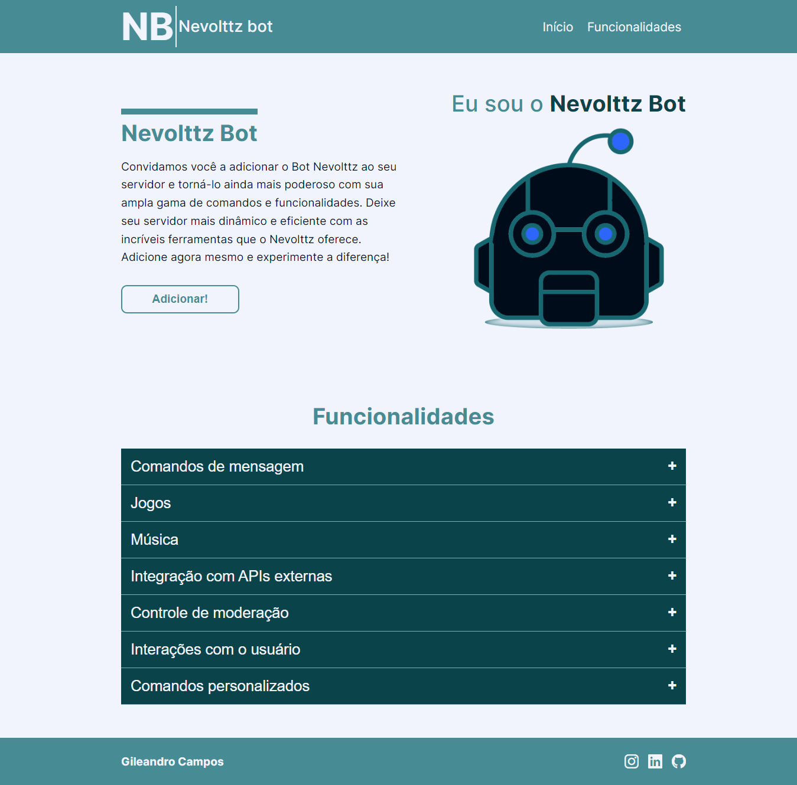

<h1 align="center"><a href="https://gilecampos.github.io/nevolttz-bot/" target ="_blank">Nevolttz Bot</a></h1>

### Esse projeto é uma Landing Page, para demonstrar detalhadamente a funcionalidade de um bot de Discord (EM DESENVOLVIMENTO).

### Link para o projeto: https://gilecampos.github.io/nevolttz-bot/

 

# Tecnologias Usadas:
- HTML
- CSS
- JAVASCRIPT
- SASS
- GIT
- GITHUB

## IMAGEM DO PROJETO

## FEATURES

- [ ] SISTEMA DE JOGOS
- [ ] SISTEMA DE MÚSICAS
- [ ] INTEGRAÇÃO COM APIs EXTERNAS
- [ ] CONTROLE DE MODERAÇÃO
- [ ] INTERAÇÕES COM USUÁRIO
- [ ] COMANDOS PERSONALIZADOS
- [ ] COMANDOS DE MENSAGEM

