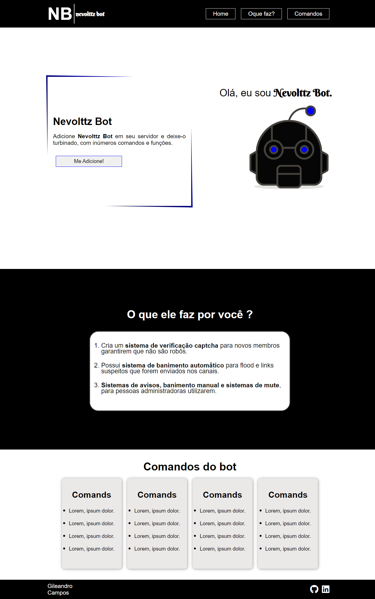

# Nevolttz Bot - Landing Page 1.0
Esse projeto é uma Landing page de um bot de discord que ainda está em desenvolvimento, projeto voltado para desmonstrar a utilidade do bot e por que você deve utiliza-lo
em seu servidor.

# Aprendizado
Desenvolvendo essa Landing page eu aprendi muito sobre efeito, e pseudo-elementos em CSS além de expandir meus conhecimentos em mobileFirst e mediaqueries.

# Tecnologias Usadas:
- HTML
- CSS
- JavaScript
- Git e Github

# Link para visualização do projeto:
https://gilecampos.github.io/nevolttz-bot/

# Imagem do projeto (DESKTOP)

<h1 style="text-align:center; margin-top: 30px; border: 2px solid white; padding: 30px; background-color: black; font-weight: bolder">COMING SOON</h1>

    Nova UI (User Interface) sendo desenvolvida, com novas cores e totalmente harmônico.
    Layout sendo criado no Figma.

